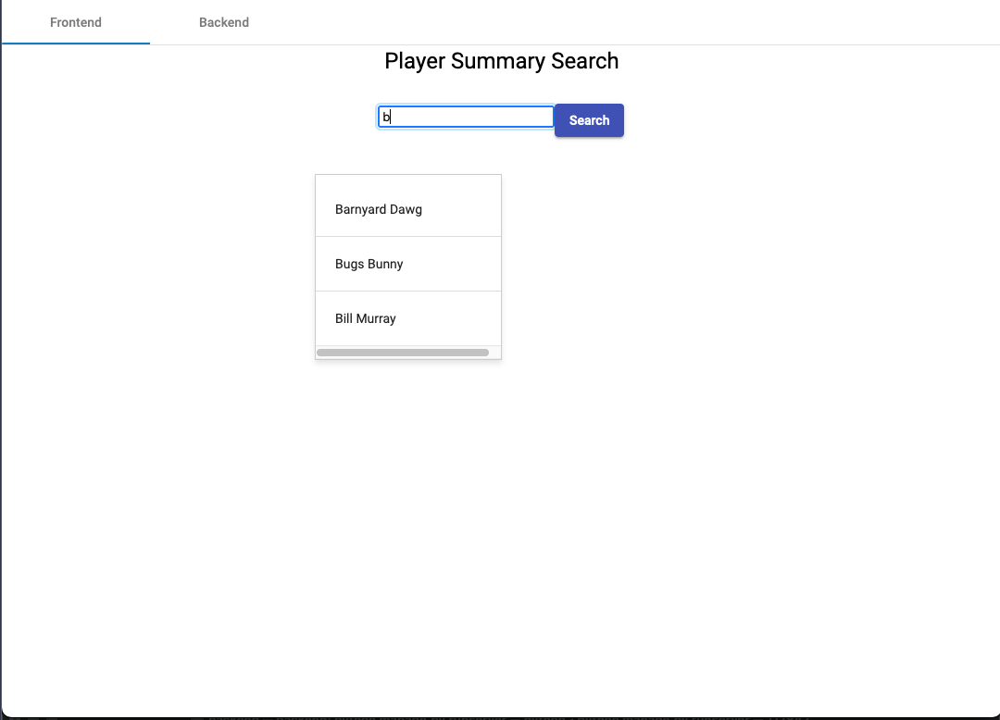
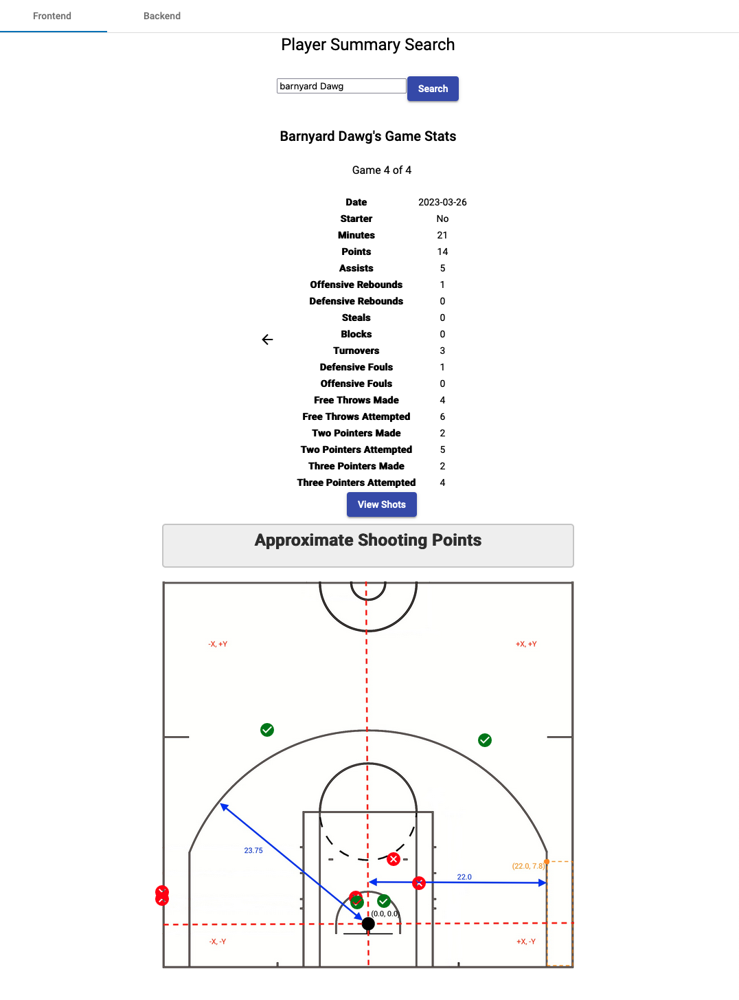

# Full-Stack Engineering: Player Search & Summary System

  
*Autocomplete search feature for player names*

  
*Frontend UI displaying player summary*

## Project Overview
This project showcases a full-stack implementation designed for a sports analytics application. It includes:

- **Database Design**: PostgreSQL schema for structured player statistics
- **Backend Engineering**: Django-based API with modular SOLID principles
- **Frontend Engineering**: Angular UI with autocomplete player search
- **Performance Optimization**: Trie-based autocomplete and Django caching

### Key Technologies
- **Backend:** Django, PostgreSQL, Django ORM, Caching
- **Frontend:** Angular, TypeScript, API Integration
- **Architecture:** Multi-layered (Controller, Handler, DataLoader)
- **Efficiency:** Trie Data Structure, Autocomplete, Caching

---

## Database Architecture
The PostgreSQL database is structured into five normalized tables for efficient data retrieval:

| Entity       | Description  |
|-------------|-------------|
| **Team**    | Stores team details, linking multiple players |
| **Player**  | Represents individual player data, linked to a team |
| **Game**    | Tracks game metadata, including teams and date |
| **PlayerStats** | Stores per-game player stats (points, assists, rebounds) |
| **Shot**    | Records individual shot attempts, success, and location |

Foreign keys ensure data integrity, linking player stats to games and teams.  
Data is structured to allow fast queries, supporting scalable analytics.

### **Database Schema**
**[View Database Schema (PDF)](Diagram/DatabaseSchema.pdf)**  

---

## System Architecture

### Multi-Layered Design for Scalability
To ensure modularity and maintainability, the backend follows SOLID principles and a three-layered architecture:

1. **Controller Layer**  
   - Handles API requests, including player search and summary retrieval.  
   - Communicates with handlers to format data.

2. **Handler Layer**  
   - Processes business logic, structures API responses.  
   - Converts database data into player summary objects.

3. **DataLoader Layer**  
   - Manages database interactions, ensuring optimized queries.  
   - Uses Django ORM for structured access to player stats and game data.

### Why This Design?
- **Separation of concerns**: Each layer has a clear responsibility.
- **Modularity**: Easily testable and extendable without breaking dependencies.
- **Scalability**: New features (e.g., team analytics) can be added seamlessly.

### **System Architecture Design**
 **[View System Architecture (PDF)](Diagram/SystemArchitectureDiagram.pdf)**  

---

## Key Features

### 1. Autocomplete Player Search
- Fast player name search using a Trie data structure.
- Reduces search complexity by storing player names and IDs in a Trie.
- Provides instant suggestions while typing.

### 2. Optimized Player Summary API
- Efficient API to retrieve player statistics per game.
- Returns structured JSON output for frontend visualization.
- Django Caching minimizes redundant database queries, improving performance.

### 3. Frontend Implementation (Angular)
- Dynamic UI for searching players and viewing detailed stats.
- Responsive interface powered by Angular components.
- Screenshots included in `frontend/screenshots/` to showcase the UI.

### **UML Diagram**
 **[View UML Diagram (PDF)](Diagram/UML.pdf)**  

---

## Conclusion: Key Learnings and Future Scalability

### Full-Stack Experience
This project provided valuable experience in **full-stack software development**, covering:

- **Data Handling:** Loading and processing raw data into a structured PostgreSQL database.
- **Database Design:** Normalizing tables and ensuring efficient data retrieval.
- **System Architecture:** Applying **SOLID principles** to build a **modular, scalable, and maintainable** backend.
- **Backend Implementation:** Using Django ORM, caching, and optimized data access patterns.
- **Frontend Development:** Designing an **interactive UI with Angular** and integrating it with the backend API.
- **Testing & Optimization:** Ensuring functional correctness and performance improvements, such as Trie-based autocomplete and caching.

### Applying SOLID Principles to Software Design
By following **SOLID design principles**, the project achieves:

- **Modularity:** Code is well-structured with clear responsibilities for each component.
- **Scalability:** The architecture supports future extensions **without modifying existing functionality**.
- **Maintainability:** The layered structure allows for easy debugging, testing, and future improvements.

### Future Scalability and Extensions
This system is designed for **future scalability**, allowing for enhancements such as:

- **Expanding beyond players** to include **teams, leagues, and game history** for broader analytics.
- **Incorporating genetic and performance data** to track player evolution over time.
- **Optimizing search algorithms** with **AI-driven autocomplete** or **personalized recommendations**.
- **Enhancing frontend visualization** with **interactive charts and real-time statistics**.
